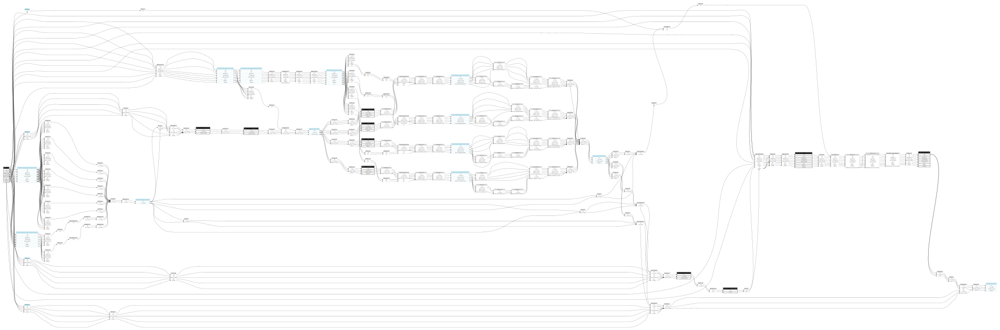
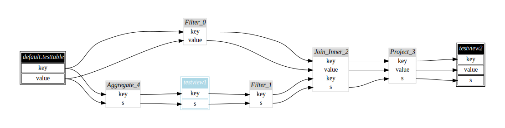
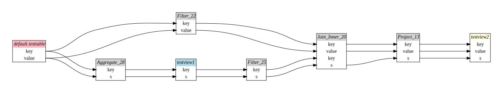
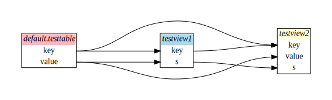
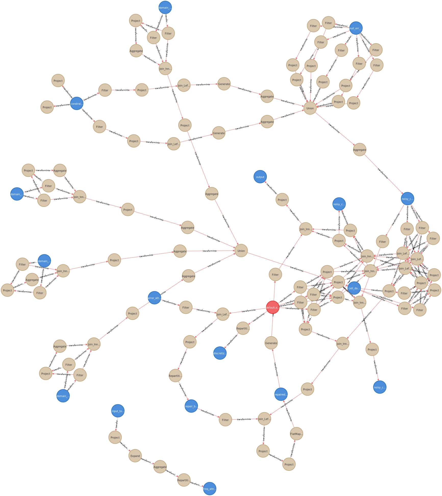

[](https://github.com/maropu/spark-sql-flow-plugin/blob/master/LICENSE)
[](https://github.com/maropu/spark-sql-flow-plugin/actions?query=workflow%3A%22Build+and+test%22)

This tool enables you to easily visualize column-level reference relationship (so called data lineage) between tables/views stored in Spark SQL.
The feature is useful for understanding your data transformation workflow in SQL/DataFrame and deciding which tables/views should be
cached and which ones should not to optimize performance/storage trade-off.

<p align="center"></p>

For instance, a diagram above is generated by this tool and it is the transformation workflow of [spark-data-repair-plugin](https://github.com/maropu/spark-data-repair-plugin).
The light blue nodes mean cached tables/views/plans and tables/views might be worth being cached if they are referenced by more than one plan
(e.g., the `freq_attr_stats__5937180596123253` view in a little left side of the center is cached because the four plans reference the view).
For more visualization examples, please see a [tpcds-flow-tests](https://github.com/maropu/spark-sql-flow-plugin/tree/spark-3.2/src/test/resources/tpcds-flow-tests/results) folder
and it includes data lineage for the [TPC-DS](http://www.tpc.org/tpcds/) queries.

## How to Visualize Data Lineage for Your Tables/Views

The tool has interfaces for Scala and Python. If you use Python, how to generate data lineage is as follows:

```
# You need to check out this repository first
$ git clone https://github.com/maropu/spark-sql-flow-plugin.git
$ cd spark-sql-flow-plugin

# NOTE: a script 'bin/python' automatically creates a 'conda' virtual env to install required
# modules. If you install them by yourself (e.g., pip install -r bin/requirements.txt),
# you need to define a env 'CONDA_DISABLED' like 'CONDA_DISABLED=1 ./bin/python'
$ ./bin/python

Welcome to
      ____              __
     / __/__  ___ _____/ /__
    _\ \/ _ \/ _ `/ __/  '_/
   /__ / .__/\_,_/_/ /_/\_\   version 3.2.0
      /_/

Using Python version 3.7.10 (default, Jun  4 2021 14:48:32)

# Defines some views for this example
>>> sql("CREATE TABLE TestTable (key INT, value INT)")
>>> sql("CREATE TEMPORARY VIEW TestView1 AS SELECT key, SUM(value) s FROM TestTable GROUP BY key")
>>> sql("CACHE TABLE TestView1")
>>> sql("CREATE TEMPORARY VIEW TestView2 AS SELECT t.key, t.value, v.s FROM TestTable t, TestView1 v WHERE t.key = v.key")

# Generates a Graphviz dot file to represent reference relationships between views
>>> from sqlflow import save_data_lineage
>>> save_data_lineage(output_dir_path="/tmp/sqlflow-output")

$ ls /tmp/sqlflow-output
sqlflow.dot     sqlflow.svg
```

`sqlflow.dot` is a Graphviz dot file and you can use the `dot` command or [GraphvizOnline](https://dreampuf.github.io/GraphvizOnline)
to convert it into a specified image, e.g., SVG and PNG.
If `dot` already installed on your machine, a SVG-formatted image (`sqlflow.svg` in this example)
is automatically generated by default:



If `contracted` is set to `true` in `save_data_lineage`, it generates the compact form
of a data lineage diagram that omits plan nodes as follows:

```
>>> save_data_lineage(output_dir_path="/tmp/sqlflow-output", contracted = true)
```



In case of Scala, you can use `SQLFlow.saveAsSQLFlow` instead to generate a dot file as follows:

```
$ ./bin/spark-shell

Welcome to
      ____              __
     / __/__  ___ _____/ /__
    _\ \/ _ \/ _ `/ __/  '_/
   /__ / .__/\_,_/_/ /_/\_\   version 3.2.0
      /_/

scala> sql("CREATE TABLE TestTable (key INT, value INT)")
scala> sql("CREATE TEMPORARY VIEW TestView1 AS SELECT key, SUM(value) s FROM TestTable GROUP BY key")
scala> sql("CACHE TABLE TestView1")
scala> sql("CREATE TEMPORARY VIEW TestView2 AS SELECT t.key, t.value, v.s FROM TestTable t, TestView1 v WHERE t.key = v.key")
scala> import org.apache.spark.sql.flow.SQLFlow
scala> SQLFlow.saveAsSQLFlow(Map("outputDirPath" -> "/tmp/sqlflow-output"))
```

## Automatic Tracking with Python '@auto_tracking' Decorator

If you have a set of the functions that take and return `DataFrame` for data transformation,
a Python decorator `@auto_tracking` is useful to track data lineage automatically:

```
>>> from pyspark.sql import functions as f
>>> from sqlflow import auto_tracking, save_data_lineage

>>> @auto_tracking
... def transform_alpha(df):
...     return df.selectExpr('id % 3 AS key', 'id % 5 AS value')
...
>>> @auto_tracking
... def transform_beta(df):
...     return df.groupBy('key').agg(f.expr('collect_set(value)').alias('value'))
...
>>> @auto_tracking
... def transform_gamma(df):
...     return df.selectExpr('explode(value)')
...

# Applies a chain of transformation functions
>>> transform_gamma(transform_beta(transform_alpha(spark.range(10))))
DataFrame[col: bigint]

>>> save_data_lineage(output_dir_path='/tmp/sqlflow-output', contracted=True)
```

Automatically tracked data lineage is as follows:



## Exports Data Lineage into Other Systems

### Adjacency List

Most graph processing libraries (e.g., [Python NetworkX](https://networkx.org))
can load a adjacency list file that includes a source node name of an edge
and its destination node name in each line. To generate it for exporting data lineage into these libraries,
a Python user can set a `graph_sink='adjacency_list'` in `save_data_lineage`.
Note that the output file only contains coarse-grained reference relationships between tables/views/plans
because it is difficult to represent column-level references in an adjacency list.

```
# NOTE: Valid `graph_sink` value is `graphviz` or `adjacency_list` (`graphviz` by default)
>>> from sqlflow import save_data_lineage
>>> save_data_lineage(output_dir_path='/tmp/sqlflow-output', graph_sink='adjacency_list', contracted=False, options='sep=,')

$ cat /tmp/sqlflow-output/sqlflow.lst
default.testtable,Aggregate_4
Project_3,testview2
Join_Inner_2,Project_3
Aggregate_4,testview1
default.testtable,Filter_0
Filter_1,Join_Inner_2
testview1,Filter_1
Filter_0,Join_Inner_2
```

To generate an adjacency list file of data lineage in Scala, you can specify `AdjacencyListSink`
in `SQLFlow.saveAsSQLFlow` as follows:

```
scala> import org.apache.spark.sql.flow.sink.AdjacencyListSink
scala> SQLFlow.saveAsSQLFlow(Map("outputDirPath" -> "/tmp/sqlflow-output"), graphSink=AdjacencyListSink(sep = ","))
```

See a [resources/networkx_example.ipynb](resources/networkx_example.ipynb) example for how to load it into Python NetowrkX.

### Neo4j Aura (Experimental feature)

To share data lineage with others, it is useful to export it into [Neo4j Aura](https://neo4j.com/cloud/aura), a fully-managed graph dtabase service:

```
>>> from sqlflow import export_data_lineage_into
>>> neo4jaura_options = {'uri': 'neo4j+s://<your Neo4j database uri>', 'user': '<user name>', 'passwd': '<password>'}
>>> export_data_lineage_into("neo4jaura", options=neo4jaura_options)
```

For instance, the exported data lineage of `spark-data-repair-plugin` (the top-most example)
is represented below on your Neo4j browser:

<p align="center"></p>

To know which views are referenced multiple times by plans, you can run a CYPHER query below for listing up the views.
Therefore, the result views can be candidiates to be cached.

```
// Lists up the views that are referenced multiple times by plans
MATCH (n:View)-[:transformInto]->(p:Plan)
WITH n, count(p) as refs
WHERE refs >= 2
RETURN n.name
```

### Writes Your Custom Graph Formatter

`SQLFlow` extracts the column-level references of tables/views/plans as a sequence
of `SQLFlowGraphNode`s and `SQLFlowGraphEdge`s internally.
Therefore, you can take extracted references and transform them into string data following your custom format:

```
scala> import org.apache.spark.sql.flow.{SQLFlow, SQLFlowGraphEdge, SQLFlowGraphNode}
scala> SQLFlow.printAsSQLFlow(contracted = true,
     |   (nodes: Seq[SQLFlowGraphNode], edges: Seq[SQLFlowGraphEdge]) => {
     |     s"""
     |        |List of nodes:
     |        |${nodes.map(n => s" => $n").mkString("\n")}
     |        |
     |        |List of edges:
     |        |${edges.map(e => s" => $e").mkString("\n")}
     |      """.stripMargin
     |   })

List of nodes:
 => name=`default.testtable`(`key`,`value`), type=table, cached=false
 => name=`testview2`(`key`,`value`,`s`), type=table, cached=false
 => name=`testview1`(`key`,`s`), type=table, cached=true

List of edges:
 => from=`default.testtable`(idx=0), to=`testview2`(idx=0)
 => from=`default.testtable`(idx=1), to=`testview2`(idx=1)
 => from=`testview1`(idx=0), to=`testview2`(idx=0)
 => from=`testview1`(idx=1), to=`testview2`(idx=2)
 => from=`default.testtable`(idx=0), to=`testview1`(idx=0)
 => from=`default.testtable`(idx=1), to=`testview1`(idx=1)
```

## Audits queries to generate data lineage (Experimental feature)

`SQLFlowListener` below incrementally appends the column-level references of a SQL/DataFrame query
into a specified sink every it succeeds:

```
scala> import org.apache.spark.sql.flow.sink.Neo4jAuraSink
scala> val sink = Neo4jAuraSink("neo4j+s://<your Neo4j database uri>", "<user name>", "<password>")
scala> spark.sqlContext.listenerManager.register(SQLFlowListener(sink))
```

To load the listener when launching a Spark cluster, you can use Spark configurations:

```
./bin/spark-shell --conf spark.sql.queryExecutionListeners=org.apache.spark.sql.flow.Neo4jAuraSQLFlowListener \
  --conf spark.sql.flow.Neo4jAuraSink.uri=neo4j+s://<your Neo4j database uri> \
  --conf spark.sql.flow.Neo4jAuraSink.user=<user name> \
  --conf spark.sql.flow.Neo4jAuraSink.password=<password>
```

## Similar Technologies

 - Datafold, Column-level lineage, https://www.datafold.com/column-level-lineage
 - SQLFlow, Automated SQL data lineage analysis, https://www.gudusoft.com
 - Prophecy, Spark: Column Level Lineage, https://medium.com/prophecy-io/spark-column-level-lineage-478c1fe4701d
 - Collibra/SQLDep, Introducing Collibra Lineage - Automated Data Lineage, https://www.collibra.com/us/en/blog/introducing-collibra-lineage
 - Tokern, Automate data engineering tasks with column-level data lineage, https://tokern.io

## References

 - Hui Miao et al., ProvDB: A System for Lifecycle Management of Collaborative Analysis Workflows, arXiv, arXiv:1610.04963, 2016.
 - Joseph M. Hellerstein et al, Ground: A Data Context Service, CIDR, 2017.
 - R. Castro Fernandez et al., Aurum: A Data Discovery System, Proceedings of ICDE, pp.1001-1012, 2018.
 - Alon Halevy et al., Goods: Organizing Google's Datasets. Proceedings of SIGMOD, pp.795–806, 2016.

## TODO

 * Implements more graph formatters, e.g., [Apache Atlas](https://atlas.apache.org/#/) and [Mermaid](https://mermaid-js.github.io/mermaid/#/) ([Issue#3](https://github.com/maropu/spark-sql-flow-plugin/issues/3))
 * Tracks data lineage between table/views via `INSERT` queries ([Issue#5](https://github.com/maropu/spark-sql-flow-plugin/issues/5))
 * Supports global temp views

## Bug Reports

If you hit some bugs and have requests, please leave some comments on [Issues](https://github.com/maropu/spark-sql-flow-plugin/issues)
or Twitter ([@maropu](http://twitter.com/#!/maropu)).
