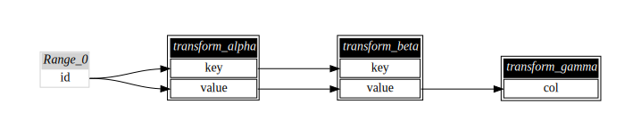

[](https://github.com/maropu/spark-sql-flow-plugin/blob/master/LICENSE)
[](https://github.com/maropu/spark-sql-flow-plugin/actions?query=workflow%3A%22Build+and+test%22)

This experimental plugin enables you to easily analyze a column-level reference relationship between views registered in Spark SQL.
The feature is useful for deciding which view should be cached and which one should not.


Note that the diagram above shows the column-level references of views that
[spark-data-repair-plugin](https://github.com/maropu/spark-data-repair-plugin) generates to repair the cells of an input table.
In the diagram, light-pink, light-yellow, and light-blue nodes represent leaf plans, views, and cached plan, respectively.

## How to Visualize Data Lineage for Your Views

```
$ git clone https://github.com/maropu/spark-sql-flow-plugin.git
$ cd spark-sql-flow-plugin
$ ./bin/spark-shell

Welcome to
      ____              __
     / __/__  ___ _____/ /__
    _\ \/ _ \/ _ `/ __/  '_/
   /__ / .__/\_,_/_/ /_/\_\   version 3.2.0
      /_/

# Defines some views for this example
scala> sql("CREATE TABLE TestTable (key INT, value INT)")
scala> sql("CREATE TEMPORARY VIEW TestView1 AS SELECT key, SUM(value) s FROM TestTable GROUP BY key")
scala> sql("CACHE TABLE TestView1")
scala> sql("CREATE TEMPORARY VIEW TestView2 AS SELECT t.key, t.value, v.s FROM TestTable t, TestView1 v WHERE t.key = v.key")

# Generates a Graphviz dot file to represent reference relationships between views
scala> import org.apache.spark.sql.SQLFlow
scala> SQLFlow.saveAsSQLFlow(path="/tmp/sqlflow-output")

$ cd /tmp/sqlflow-output
$ ls
sqlflow.dot     sqlflow.svg
```

`sqlflow.dot` is a Graphviz dot file and you can use the Graphviz `dot` command or [GraphvizOnline](https://dreampuf.github.io/GraphvizOnline)
to convert the generated file into a specified image, e.g., SVG and PNG.
If `dot` already installed on your machine, a SVG-formatted image (`sqlflow.svg` in this example)
is automatically generated by default. Finally, the SVG-formatted image is as follows:


If `contracted` is set to `true`, a generated diagram shows nodes for leaf plans and views:

```
scala> SQLFlow.saveAsSQLFlow(path="/tmp/sqlflow-contracted-output", contracted = true)
```


If you are using PySpark, you can run `bin/python` and use `save_data_lineage` to generate a dot file as follows:

```
$ ./bin/python

Welcome to
      ____              __
     / __/__  ___ _____/ /__
    _\ \/ _ \/ _ `/ __/  '_/
   /__ / .__/\_,_/_/ /_/\_\   version 3.2.0
      /_/

Using Python version 3.7.10 (default, Jun  4 2021 14:48:32)

>>> spark.sql("CREATE TABLE TestTable (key INT, value INT)")
>>> spark.sql("CREATE TEMPORARY VIEW TestView1 AS SELECT key, SUM(value) s FROM TestTable GROUP BY key")
>>> spark.sql("CACHE TABLE TestView1")
>>> spark.sql("CREATE TEMPORARY VIEW TestView2 AS SELECT t.key, t.value, v.s FROM TestTable t, TestView1 v WHERE t.key = v.key")
>>> save_data_lineage(output_path="/tmp/sqlflow-output")
```

## Automatic Tracking with Python Decorators

If you have a set of the functions that take and return `DataFrame` for data transformation,
a Python decorator `@auto_tracking` is useful to track data lineage automatically:

```
$ ./bin/python

>>> @auto_tracking
... def transform_alpha(df):
...     return df.selectExpr('id % 3 AS key', 'id % 5 AS value')
...
>>> @auto_tracking
... def transform_beta(df):
...     return df.groupBy('key').agg(f.expr('collect_set(value)').alias('value'))
...
>>> @auto_tracking
... def transform_gamma(df):
...     return df.selectExpr('explode(value)')
...

# Applies a chain of transformation functions
>>> transform_gamma(transform_beta(transform_alpha(spark.range(10))))
DataFrame[col: bigint]

>>> save_data_lineage(output_path='/tmp/sqlflow-output', contracted=True)
```

An automatically generated data lineage is as follows:



## TODO

 * Supports global temp views
 * Refines Graphviz params to improve a generated image, e.g., node colors and size

## Bug Reports

If you hit some bugs and have requests, please leave some comments on [Issues](https://github.com/maropu/spark-sql-flow-plugin/issues)
or Twitter ([@maropu](http://twitter.com/#!/maropu)).

