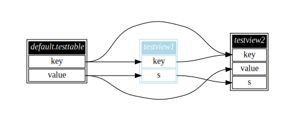

[](https://github.com/maropu/spark-sql-flow-plugin/blob/master/LICENSE)
[](https://github.com/maropu/spark-sql-flow-plugin/actions?query=workflow%3A%22Build+and+test%22)

This experimental plugin enables you to easily analyze a column-level reference relationship between views registered in Spark SQL.
The feature is useful for deciding which views should be cached and which should not.


Note that the diagram above shows the column-level references of temporary views that
[spark-data-repair-plugin](https://github.com/maropu/spark-data-repair-plugin) generates to repair the cells of an input table.
In the diagram, light-pink, light-yellow, and light-blue nodes represent leaf plans, temporary views, and cached plan, respectively.

## How to visualize your views

```
$ git clone https://github.com/maropu/spark-sql-flow-plugin.git
$ cd spark-sql-flow-plugin
$ ./bin/spark-shell

Welcome to
      ____              __
     / __/__  ___ _____/ /__
    _\ \/ _ \/ _ `/ __/  '_/
   /__ / .__/\_,_/_/ /_/\_\   version 3.1.2
      /_/

# Defines some views for this example
scala> sql("CREATE TABLE TestTable (key INT, value INT)")
scala> sql("CREATE TEMPORARY VIEW TestView1 AS SELECT key, SUM(value) s FROM TestTable GROUP BY key")
scala> sql("CACHE TABLE TestView1")
scala> sql("CREATE TEMPORARY VIEW TestView2 AS SELECT t.key, t.value, v.s FROM TestTable t, TestView1 v WHERE t.key = v.key")

# Generates a Graphviz dot file to represent reference relationships between views
scala> import org.apache.spark.sql.SQLFlow
scala> SQLFlow.saveAsSQLFlow(path="/tmp/sqlflow-output")

$ cd /tmp/sqlflow-output
$ ls
sqlflow.dot     sqlflow.svg
```

`sqlflow.dot` is a Graphviz dot file and you can use the Graphviz `dot` command or [GraphvizOnline](https://dreampuf.github.io/GraphvizOnline)
to convert the generated file into a specified image, e.g., SVG and PNG.
If `dot` already installed on your machine, a SVG-formatted image (`sqlflow.svg` in this example)
is automatically generated by default. Finally, the SVG-formatted image is as follows:



If `contracted` is set to `true`, a generated diagram shows nodes for leaf plans and temporary views:

```
scala> SQLFlow.saveAsSQLFlow(path="/tmp/sqlflow-contracted-output", contracted = true)
```


## Bug reports

If you hit some bugs and requests, please leave some comments on [Issues](https://github.com/maropu/spark-sql-flow-plugin/issues)
or Twitter ([@maropu](http://twitter.com/#!/maropu)).

