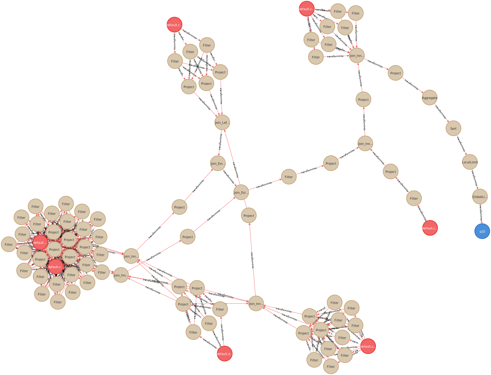

## Data Lineage Example for TPC-DS queries on Neo4j Aura

You can generate a data lineage example for 103 TPC-DS queries on Neo4j Aura by using a command below:

```
$ NEO4J_AURADB_URI="neo4j+s://<your Neo4j database uri>" NEO4J_AURADB_USER="<user name>" NEO4J_AURADB_PASSWD="<password>" \
  ./build/mvn -Dtest=none -DwildcardSuites=org.apache.spark.sql.flow.TPCDSFlowWithNeo4jAuraSink test
```

Since the generated data lineage is too large to be visualized in a Neo4j browser,
you need to select a part of the data lineage that you wish to analyze, e.g.,
a CYPHER query below prints data lineage for [the TPC-DS q10 query](../src/test/resources/tpcds-flow-tests/inputs/q10.sql):

```
MATCH p=(:Table)-[:transformInto*]->(:View {name: "q10"})
WHERE ALL(r IN relationships(p) WHERE "q10" IN r.dstNodeIds)
RETURN p
```

<p align="center"></p>

## List of Other Useful CYPHER Queries

### Selects the Paths Whose Reference Count Is More Than 128 in 3 Days

```
CALL {
  MATCH (n)-[t:transformInto]->(q:Query)
  WHERE duration.inDays(datetime(q.timestamp), datetime()).days <= 3
  WITH n, count(size(t.dstNodeIds)) AS refCnt, collect(q) AS qs
  WHERE refCnt > 128
  UNWIND qs AS q
  RETURN q
}
MATCH p=(s)-[*]->(q)
WHERE s:LeafPlan OR s:Table OR s:View
RETURN p
```

### Removes query nodes older than 90 days

```
// Removes older query node IDs from related relationships
MATCH (n)-[t:transformInto*]->(q:Query)
WHERE duration.inDays(datetime(q.timestamp), datetime()).days > 90
SET head(t).dstNodeIds = [uid IN head(t).dstNodeIds WHERE uid <> q.uid]
RETURN n;

// Then, removes the older nodes
MATCH (q:Query)
WHERE duration.inDays(datetime(q.timestamp), datetime()).days > 90
DETACH
DELETE q;

// Finally, removes nodes if the reference count of their relationships is 0
MATCH ()-[t:transformInto]->(n)
WHERE size(t.dstNodeIds) = 0
DETACH
DELETE n;
```

## Prints Data Lineage as a Mermaid-formatted Flowchart (Scala-only)

[Mermaid](https://mermaid-js.github.io/mermaid/#/) is a markdownish syntax for letting you create diagrams and visualizations using text and code.
You can get a Mermaid-formatted data lineage by using `MermaidSink` as follows:

```
scala> import org.apache.spark.sql.flow.SQLFlow
scala> import org.apache.spark.sql.flow.sink.MermaidSink
scala> SQLFlow.printAsSQLFlow(contracted = false, graphFormat = MermaidSink)

flowchart LR %% Automatically generated by org.apache.spark.sql.flow.sink.MermaidSink
    Aggregate_f228b39(Aggregate)
    Filter_88e94c9(Filter)
    Join_Inner_caa475c(Join_Inner)
    Project_f949a24(Project)
    default.testtable[["default.testtable(key,value)"]]
    testview2[["testview2(key,value,s)"]]
    Filter_91d962e(Filter)
    testview1[["testview1(key,s)"]]
    Join_Inner_caa475c-->Project_f949a24
    Filter_91d962e-->Join_Inner_caa475c
    Filter_88e94c9-->Join_Inner_caa475c
    default.testtable-->Filter_91d962e
    testview1-->Filter_88e94c9
    Project_f949a24-->testview2
    default.testtable-->Aggregate_f228b39
    Aggregate_f228b39-->testview1
```

Since GitHub supports the Mermaid syntax, the generated Mermaid flowchart above is shown like this:

```mermaid
flowchart LR %% Automatically generated by org.apache.spark.sql.flow.sink.MermaidSink
    Aggregate_f228b39(Aggregate)
    Filter_88e94c9(Filter)
    Join_Inner_caa475c(Join_Inner)
    Project_f949a24(Project)
    default.testtable[["default.testtable(key,value)"]]
    testview2[["testview2(key,value,s)"]]
    Filter_91d962e(Filter)
    testview1[["testview1(key,s)"]]
    Join_Inner_caa475c-->Project_f949a24
    Filter_91d962e-->Join_Inner_caa475c
    Filter_88e94c9-->Join_Inner_caa475c
    default.testtable-->Filter_91d962e
    testview1-->Filter_88e94c9
    Project_f949a24-->testview2
    default.testtable-->Aggregate_f228b39
    Aggregate_f228b39-->testview1
```
